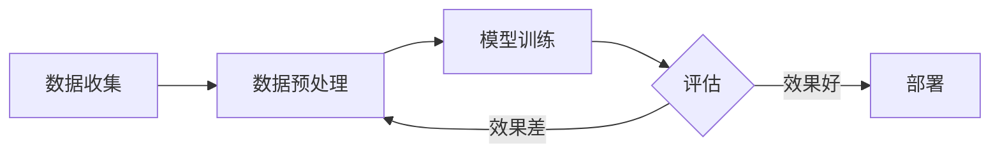

---
tags:
  - 示例
  - MkDocs
---

# 示例笔记：功能演示

本页展示了常用的写作功能，你可以把它当作模板使用。

## 数学公式

行内公式：梯度下降更新规则 \(\theta_{t+1} = \theta_t - \eta \nabla L(\theta_t)\)

独立公式块：

\[
\mathcal{L}(\theta) = -\frac{1}{N}\sum_{i=1}^{N} \left[ y_i \log \hat{y}_i + (1 - y_i) \log(1 - \hat{y}_i) \right]
\]

## 代码块

```python title="简单的 PyTorch 训练循环"
import torch
import torch.nn as nn

model = nn.Linear(10, 1)
optimizer = torch.optim.Adam(model.parameters(), lr=1e-3)
criterion = nn.MSELoss()

for epoch in range(100):
    pred = model(x_train)
    loss = criterion(pred, y_train)
    optimizer.zero_grad()
    loss.backward()
    optimizer.step()
```

## 提示框 (Admonitions)

!!! note "笔记"
    这是一个笔记提示框，适合补充说明。

!!! tip "技巧"
    使用 `mkdocs serve` 可以实时预览你的修改。

!!! warning "注意"
    数学公式中的 `|` 符号在 Markdown 表格中需要转义。

??? question "可折叠的提示框（点击展开）"
    这是一个可折叠的提示框，适合放 FAQ 或补充细节。

## Mermaid 图表



## 标签页

=== "Python"

    ```python
    print("Hello, Research!")
    ```

=== "Julia"

    ```julia
    println("Hello, Research!")
    ```

=== "MATLAB"

    ```matlab
    disp('Hello, Research!')
    ```

## 任务列表

- [x] 搭建 MkDocs 站点
- [x] 配置 LaTeX 公式支持
- [ ] 写第一篇正式笔记
- [ ] 添加更多论文阅读记录

## 脚注

这是一个包含脚注的句子[^1]。

[^1]: 这是脚注的内容，可以放参考文献信息。
